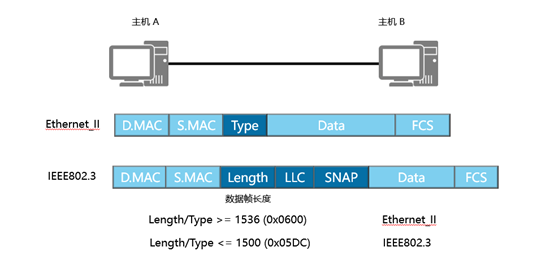
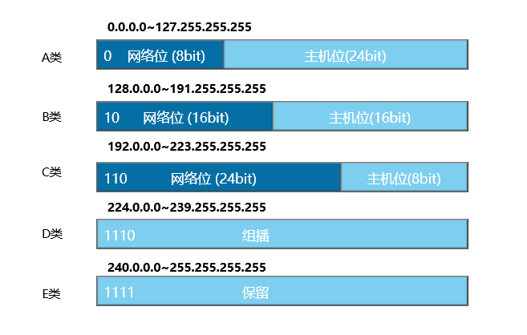
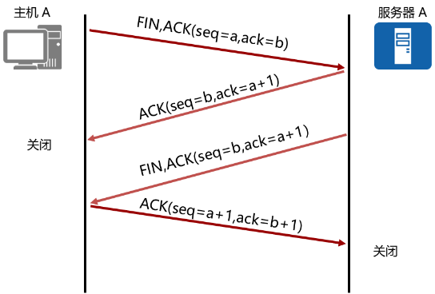
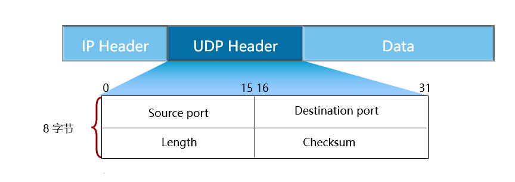

# HCIA数据通信基础

## 物理层

### 双绞线

>8bit 为一个字节
一个字母 1个字节
一个汉字 2个字节
传输速度：兆（Mbps）
下载速度为传输速度的1/8

| **版本种类**（数字越大，版本越新） |              |
|-----------------------------|--------------|
| 5类双绞线（标准双绞线）           | 100Mbps      |
| 超5类（5e）常见                   | 1000Mbps     |
| 6类双绞线                       | 1000Mbps以上 |

| 以太网标准 | 线缆类别          | 最长有效传输距离 |
|------------|---------------|-----------------|
| 10BASE-T   | 两对3/4/5类双绞线 | 100米            |
| 100BASE-TX | 两对5类双绞线     | 100米            |
| 1000BASE-T | 四对5e类双绞线    | 100米            |

#### 屏蔽与非屏蔽双绞线

屏蔽：环境要求，接地
常见非屏蔽

#### 线序规格

8根线芯

| 1 2 3 4 5 6 7 8 |                               |
|-----------------|-------------------------------|
| 1236            | 数据传输                      |
| 45              | 语音电话                      |
| 78              | 备用                          |
| 56A             | 1 3 2 6 调换                  |
| 56B             | 橙白 橙绿 白绿 蓝白 蓝棕 白棕 |

### 光纤

>玻璃纤维 光的全反射
反射一种光源 单模
反射多种光源 多模
贵在接口，光纤要有专门的光模块，把光信号转换为电信号
黄色（单模）抗干扰性强 传输距离更长 家庭 有碰撞就会失真，丢包
橙色（多模）抗干扰性差 传输距离较长
水绿色 企业 光缆：传输距离长

| 以太网标准  | 线缆类别      | 最长有效传输距离 |
|-------------|-----------|:---------------:|
| 10BASE-F    | 单模/多模光纤 |     2000 米      |
| 100BASE-FX  | 单模/多模光纤 |     2000 米      |
| 1000BASE-LX | 单模/多模光纤 |      316 米      |
| 1000BASE-SX | 多模光纤      |      316 米      |

### 同轴电缆

| 以太网标准 | 电缆类别   | 最长有效传输距离 |
|------------|--------|:---------------:|
| 10BASE5    | 粗同轴电缆 |      500米       |
| 10BASE2    | 细同轴电缆 |      185米       |

### console登录实验

#### password

无用户名，一个设备只能设置一个密码，连续三次输错需要等待时间

```powershell
<Huawei>system-view                             
#进入系统视图sys
[Huawei]sysname R1                                                      
#设置路由器名
[Huawei]user-interface console 0                                        
#进入控制台视图
[Huawei-ui-console0]authentication-mode password                        
#配置认证方式为密码认证
[Huawei-ui-console0]set authentication password cipher Huawei@123       
#配置认证密码为Huawei@123
[Huawei-ui-console0]user privilege level x                              
#通常不进行权限设置，权限设置错误后果很严重
[Huawei-ui-console0]return                                             
#返回用户视图
<Huawei> save                                                           
#保存配置文件
```

如果想修改密码，可通过set authentication password cipher xxx设置（xxx代表需要修改的密码）

```powershell
[R1]user-interface console 0                                    
#先进入到console 0口进行配置
[R1-ui-console0]set authentication password cipher admin1234    
#修改密码为admin1234
```

#### aaa

存放用户名和密码
使用AAA认证模式，配置使用用户名和密码登录console口，以及管理权限级别

```powershell
[R1] user-interface console 0                           
#配置console 0口
[R1-ui-console0] authentication-mode aaa                
#配置认证模式为aaa
[R1] aaa                                                
#进入aaa模式下配置用户和权限
[R1-aaa] local-user user password cipher user123        
#创建用户user，密码user123
#如果需要修改密码，也可在此重新配置密码来修改。
Info: Add a new user
[R1-aaa] local-user user privilege level 15             
#配置用户user的权限为level 15
#此处用户等级有0-15共16级，可根据需要配置不同的用户使用不同的权限
[R1-aaa] local-user a service-type terminal             
#设置协议服务类型 默认为 terminal终端
```

#### none

在任何视图下查看配置

```powershell
[R1]display current-configuration        #查看当前设备所有配置
[R1]display this                           #查看当前界面配置
```

### 双工模式

<div align=center>

</div>

>双工模式：双向传输数据
单工模式：只能发送/接收数据 &emsp;如：收音机
半双工：能发送数据也能接收数据，但不能同时进行&emsp;如：对讲机
全双工：能发送数据也能接收数据，可以同时进行
两种双工模式都支持双向数据传输

### 冲突域

>**在一个共享介质中所有产生冲突节点的集合**
**解决**：载波监听/多路访问检测机制 CSMA/CD &emsp;通过部署交换机来解决
**工作原理**：先听后发，边听边发，冲突停发，延迟后随机重发（通过这种方式避免冲突产生）
==交换机每个接口都是一个冲突域==

### 通过网络设备实现通信

>**二层设备**：OSI七层参考模型倒数第二层数据链路层
（看目的MAC地址  MAC地址表）
交换机：先看帧尾是否合法 再看帧头（源目MAC）
MAC地址表：MAC地址和交换机端口之间的映射关系
（MAC地址表在交换机中保存）
查看MAC地址表：display mac-address
**三层设备**：工作在网络层 （看目的IP  路由表）
路由器、三层交换机（可以配置IP地址）

***

## 参考模型

### OSI七层参考模型

- 应用层：提供网络接口(产生数据)
- 表示层：对数据格式化、加密，解密等操作
- 会话层：建立会话，维护、管理会话窗口
- 传输层：建立端到端连接（简单认为应用程序服务）端口号来确定服务
- 网络层：进行IP寻址和路由选择
- 数据链路层：建立设备与设备之间的连接（MAC标识目标设备）
- 物理层：以比特流形式在传输介质上进行传输

### TCP/IP四层参考模型

- 应用层

  应用层对应于OSI参考模型的高层，为用户提供所需要的各种服务，例如：FTP、Telnet、DNS、SMTP等

- 传输层

  [传输层](https://baike.baidu.com/item/传输层)对应于OSI参考模型的传输层，为应用层实体提供端到端的通信功能，保证了数据包的顺序传送及数据的完整性。该层定义了两个主要的协议：[传输控制协议](https://baike.baidu.com/item/传输控制协议)（TCP）和[用户数据报协议](https://baike.baidu.com/item/用户数据报协议)（UDP)

- 网际层

  网际际层对应于OSI参考模型的网络层，主要解决[主机](https://baike.baidu.com/item/主机)到主机的通信问题

  有三个主要协议：[网际协议](https://baike.baidu.com/item/网际协议)（IP）、互联网组管理协议（IGMP）和互联网控制[报文](https://baike.baidu.com/item/报文)协议（ICMP）

- 网络接口层
  
  网络接入层与[OSI参考模型](https://baike.baidu.com/item/OSI参考模型)中的[物理层](https://baike.baidu.com/item/物理层)和[数据链路层](https://baike.baidu.com/item/数据链路层)相对应，负责监视数据在主机和网络之间的交换

***

## 数据链路层

### 数据最终传输形式

> ==数据帧：数据帧头 + 数据包头（IP地址）+ 数据段头（端口号）+ DATA + 帧尾==
request请求包   &emsp;reply回应包
Src源 &emsp;Dst目的
Frame 物理层
帧头

### 数据封装过程

- 在应用层产生数据
- 在表示层对数据加密、解密
- 在会话层建立并维护会话窗口（数据DATA）
- 在传输层对数据加上段头（TCP头部 源目端口号）形成数据段
- 继续在网络层对数据段加上包头（源目IP）形成数据包
- 数据链路层 最后继续在数据包头前后分别加上帧头（源目MAC）和帧尾（帧校验）
- 物理层把封装好的数据包转变为电信号在网络中传输（比特流）

### 解封装过程

- 物理层将电信号转为二进制数据（0101的比特高低电平）
- 数据链路层 查看MAC地址，地址为自己，则拆掉MAC头部，继续传输，不是自己则丢弃数据

- 网络层 查看IP，地址为自己则拆掉IP头部，继续传输，不是自己丢弃
- 传输层 查看段头，判断数据应该传到哪里，然后重组数据，传输到应用层
- 应用层 将二进制数据转换为原始数据

### 以太网帧格式

<div align=center>

</div>

>**以太网II帧（Ethernet_II）**
数据帧头(源目MAC地址)+数据包头(IP地址)+数据段头(端口号)+DATA+帧尾(FCS)
type
0X0800 &emsp;IP协议帧
0X0806 &emsp;ARP协议帧
**802.3帧（IEEE 802.3）**

### MAC地址

>物理硬件地址（物理网卡）
用于唯一标识物理设备，无法修改
MAC地址：54-89-98-DF-78-9E
在设备上查看：5489：98DF：789E（冒分十六进制）
0101 0100-1000 1001-1001 1000…（十六进制第二位为偶数即为单播）
一个数字4bit，两个数字8bit，6个字节=48比特
前24比特 OUI组织分配（IEEE管理和分配）
后24比特 厂商自行分配
通过这个来全球唯一标识一个网卡MAC地址，无法修改，出厂自带（单播MAC）

```shell
PC>ipconfig                   #查看网卡
<R1>display interface     #查看路由器端口MAC
```

### 广播域

>一个BUM帧（广播帧、组播帧、单播帧　能够执行泛洪的帧）能够传递的范围，广播报文所能到达的范围
B：广播帧  
U：未知单播帧  
M：组播帧
==交换机无法隔离广播域，只有路由器可以隔离广播域==
广播域扩大容易造成信息泄露

### 广播域过大的影响

>• 广播风暴，垃圾流量过多
• 信息安全

### 路由器如何解决限制广播域大小

>• 通过部署路由器来隔离广播域
>路由器每个接口都是广播域（路由器不会转发广播报文）
>• 通过VLAN技术实现交换机来隔离广播域
>注：交换机是用来隔离冲突域的，每个接口都是一个冲突域，无法隔离广播域
>
>相同广播域之间可以直接二层通信
>不同广播域之间不可以直接二层通信，需要借助三层设备进行三层通信
>一个广播域就是一个网段

### 三种通讯模式

>单播：一对一
>组播：一对多（一组特定成员）
>广播：一对多（一对所有）
>
>MAC地址第8比特位为0  单播MAC
>MAC地址第8比特位为1  组播MAC
>MAC地址全为1（全F）  广播MAC

### Telnet远程登录实验

>前提：网络互通(能ping通地址)
R1 地址 远程登录
R2 地址 被远程登录

#### password模式

```powershell
#配置Ip地址
[Huawei] user-interface vty 0 4             
#进入vty接口视图，允许同时5台设备
[Huawei-ui-vty0-4] authentication-mode      
#选择模式
[Huawei-ui-vty0-4] user privilege level x 
#设置权限 (默认为0)
[Huawei-ui-vty0-4] protocol inbound telent 
#默认telnet 不显示

<Huawei> telnet 10.1.1.2     
#在其它设备用户视图下进行验证（在用户视图下进行telnet登录）

#R1 登陆方
进入用户视图（只能查看命令）
<Huawei>sys                                 
#进入系统视图 system-view
[Huawei] sysname R1          
#命名
[R1] interface GigabitEtherent 0/0/0    
[R1-GigabitEthernet0/0/0] ip address 10.1.1.1 24    
#接口ip
[R1-GigabitEthernet0/0/0] display this              
#查看状态
<R1>ping 10.1.1.2                                   
#用户系统视图都行

验证
<Huawei>telnet         
#远程登录协议
<Huawei>telnet 10.1.1.2      
#用户视图下
Password:             
#输入密码

```

#### aaa模式

```powershell
[Huawei]user-interface vty 0 4                                                   
#进入vty接口视图
[Huawei-ui-vty0-4] au
[Huawei-ui-vty0-4] authentication-mode aaa
[Huawei-ui-vty0-4] aaa
[Huawei-aaa] local-user daxian password cipher 666 privilege levle 1
[Huawei-aaa] display this
[Huawei-aaa] local-user daxian service-type telnet                            
#选择服务
[Huawei-aaa] local-user cuozao password cipher 888 privilege level 15
[Huawei-aaa] local-user daxian service-type terminal telnet                
#两个都开启

#R2 #被登录方
<Huawei> sys
[Huawei] interface g
[Huawei] interface GigabitEtherent 0/0/0                                   
#进入端口
[Huawei-GigabitEthernet0/0/0] ip address 10.1.1.2 24                       
#ip地址不能冲突
[Huawei-GigabitEthernet0/0/0] display this
[Huawei-GigabitEthernet0/0/0] q                                               
#退出当前视图
[Huawei] user-interface  vty 0 4                                           
#支持5个人同时登录
[Huawei-ui-vty0-4] au
[Huawei-ui-vty0-4] authentication-mode password
[Huawei-ui-vty0-4] protocol ?
[Huawei-ui-vty0-4] protocol inbound telnet                                
#远程登录协议
[Huawei-ui-vty0-4] user privilege level ?
[Huawei-ui-vty0-4] user privilege level 15（默认为０）
[Huawei-ui-vty0-4] telnet server enable                                     
#默认开启
```

***

## 网络层

### 进制转换

1字节=8比特
|  0  | 0  | 0  | 0  | 0  | 0  | 0  | 0  |
|:---:|:--:|:--:|:--:|:--:|:--:|:--:|:--:|
| 27  | 26 | 25 | 24 | 23 | 22 | 21 | 20 |
| 128 | 64 | 32 | 16 | 8  | 4  | 2  | 1  |

>十进制转二进制
111 - 64 = 47 - 32 = 15 - 8 = 7 – 4 = 3 – 2  = 1 - 1  = 0
十进制转八进制/十六进制
先转二进制，再以3位/4位一组转换

### IP地址

>三层IP头部  网络层就是IP层  主要看的就是IP地址
IP地址 4字节=32比特  192.168.1.1（点分十进制）
IP地址分为两部分 <span style="color:#0080d6;">网络部分</span>+<span style="color:#ffce49;">主机部分</span> （通过网络掩码来区分）
<div style="font-family:JetBrains Mono">
<span style="color:#0080d6;">1100 0000.1010 1000.0000 0001.</span><span style="color:#ffce49;">0000 0001</span><br>
1111 1111.1111 1111.1111 1111.0000 0000<br>
192.169.1.0/24  24位网络位  8位主机位<br>
192.168.1.1 - 192.168.1.254<br>
192.168.1.0 – 192.168.1.255<br>
</div>
==主机位全为0为网络地址（不可配置） 作用：代表该网段所有地址
主机位全为1为广播地址（不可配置） 作用：广播作用==

>IPV4地址32位
IPV6地址128位
通过地址转换来实现节约地址

### 查看ip地址

```powershell
display cur                      #查看全部配置
display this                     #接口视图
display ip interface brief         #以表格形式查看IP  任何视图
```

### IP地址分类

<div align=center>

</div>

| 32比特          0.0.0.0 - 255.255.255.255 |      |                  |
| ----------------------------------------- | ---- | ---------------- |
| 超大型网络                                | A类  | 前一个比特为0    |
| 大型网络                                  | B类  | 前两个比特为10   |
| 小型网络                                  | C类  | 前三个比特为110  |
| 组播IP                                    | D类  | 前四个比特为1110 |
| 保留IP                                    | E类  | 前五个比特为1111 |

>A类网段：127-0+1=128
>B类网段：191-128+1=64   64×256=16384
>C类网段：223-192+1=32   32×256×256=2097152
>这40多亿地址数默认分为128个A类网段，64×256个B类网段，32×256×256个C类网段

### 地址数

>一个网段所有的地址数目
192.168.1.0 ~ 192.168.1.255  (256个地址数）
172.16.0.0 /16 &emsp;256×256 = 28× 28 = 216
==地址数=2^主机位^==

### 可用地址

>可以配置的地址，也叫主机地址、合法地址
>==可用地址数=地址数-2==（减去一头一尾，网络地址和广播地址）
>
>一个A类网段地址数有2^24^个地址
>一个B类网段地址数有2^16^个地址
>一个C类网段地址数有2^8^个地址

### 特殊地址

```text
0.0.0.0       代表所有网段的所有地址
255.255.255.255                    代表所有的广播地址
127.0.0.0-127.255.255.255         环回测试地址
```

### 私有地址

```text
A类地址内截取一段作为私有地址   10.0.0.0~10.255.255.255 
B类地址内截取一段作为私有地址   172.16.0.0~172.31.255.255
C类地址内截取一段作为私有地址   192.168.0.0~192.168.255.255
```

### 有类编址的缺陷

- 地址浪费
- 安全问题

### 子网划分

>子网数（地址数）=2^(掩码-默认掩码)^
可用地址数=2^(掩码-默认掩码)^-2

```text
192.168.1.0 /24  地址数=2^(32-24)  主机位=32-24=8  /24（掩码位）
1100 0000.1010 1000.0000 0001.0000 0000
1111 1111.1111 1111.1111 1111.0000 0000
192.168.1.0 /25
1100 0000.1010 1000.0000 0001.0000 0000
1111 1111.1111 1111.1111 1111.1000 0000
192.168.1.0/26        192.168.1.0  ~192.168.1.63
192.168.64.0/26      192.168.1.64 ~192.168.1.127
192.168.128.0/26    192.168.1.128~192.168.1.191
192.168.192.0/26    192.168.1.192~192.168.1.255
```

例：一家公司有四个部门 192.168.1.0 /24
部门A：32台主机  &emsp;部门B：60台主机  &emsp;部门C：2台主机  &emsp;部门D：10台主机

><span style="font-family:Cascadia Mono">B部门：(先给主机多的部门分，减少浪费)<br>60主机 < 2^n^-2（n为主机位）<26=64   主机位为6，掩码为26，每个子网地址数为64
>192.168.1.0/26~192.168.1.63<br>A部门：
>32主机 < 2^n^-2（n为主机位）<26=64  &emsp;&emsp;主机位为6，掩码为26，每个子网地址数为64
>192.168.1.64/26~192.168.1.127<br>D部门：
>10主机 < 2^n^-2（n为主机位）<24=16  &emsp;&emsp;主机位为4，掩码为28，每个子网地址数为16
>192.168.1.128/28~192.168.1.143<br>C部门：
>2主机 < 2^n^-2（n为主机位）<22=16   &ensp;&emsp;&emsp;主机位为2，掩码为30，每个子网地址数为4
>192.168.1.144/30~192.168.1.147</span>

例：192.168.10.0/24 &emsp;&emsp;&emsp;&emsp;192.168.10.200/27
><span style="font-family:Cascadia Mono">子网数：2^(子网位数)^ = 2^(27-24)^ =2^3=8    &emsp;&emsp;&emsp;地址数：2^(32-27)^=32 <br>主机位：32-27=5  &emsp;1100 0000.1010 1000.0000 1010.1100 1000 <br>网络地址：&emsp;&emsp;&emsp;&emsp;&emsp;1100 0000.1010 1000.0000 1010.1100 0000  &emsp;&emsp;192.168.10.192<br>广播地址：&emsp;&emsp;&emsp;&emsp;&emsp;1100 0000.1010 1000.0000 1010.1101 1111  &emsp;&emsp;192.169.10.223
192.168.10.0~192.168.10.31 <br>32~63  &emsp;64~95  &emsp;96~127  &emsp;128~159  &emsp;160~191  192~223
192.168.10.224~192.168.10.255 <br>所在网段：192.168.10.192/27</span>

例：172.16.0.0/16  给300台主机划分子网
><span style="font-family:Cascadia Mono;"> 300<2^9=512  掩码位23  32-9=23   &emsp;9位主机位<br>172.16.0.0/23  &emsp;&emsp;172.16.0.0~172.16.1.255 <br>1010 1100.0001 0000.0000 0000 <br>1010 1100.0001 0001.1111 1111</span>

例：写出以下地址的网络地址和广播地址
><span style="font-family:Cascadia Mono">172.16.100.100/22   32-22=10<br>172.16.0110 0100.<span style="color:red">0110 0100</span><br>172.16.0110 0100.<span style="color:red">0000 0000</span>     &emsp;网络地址：172.16.100.0<br>172.16.0110 0111.<span style="color:red">1111 1111</span>   &emsp;广播地址：172.16.103.255<br><br>10.11.12.13/17&emsp;&emsp;32-17=15 <br>10.11.0<span style="color:red">000 1100.0000 1101</span><br>10.11.0<span style="color:red">000 0000.0000 0000</span>   &emsp;网络地址：10.11.0.0<br>10.11.0<span style="color:red">111 1111.1111 1111</span>   &emsp;广播地址：10.11.127.255</span>

例：公司网段172.16.0.0/16，规划5个部门，
分别部署70、80、30、10、4台主机，合理规划地址网段

><span style="font-family:Cascadia Mono">80<2^7=128 主机位：7  掩码：25  每个子网地址数128<br>
<span style="color:#3488f7">172.16.0.0/25~172.16.0.127</span>
<br>70<2^7=128 &emsp;&ensp;主机位：7  &emsp;掩码：25  &emsp;&emsp;每个子网地址数128<br>
<span style="color:#3488f7">172.16.0.128/25~172.16.0.255</span>
<br>30<2^5=32 &emsp;&emsp;主机位：5  &emsp;掩码：27  &emsp;&emsp;每个子网地址数32<br>
<span style="color:#3488f7">172.16.1.0/27~172.16.1.31</span>
<br>10<2^4=16 &emsp;&emsp;主机位：4  &emsp;掩码：16  &emsp;&emsp;每个子网地址数16 <br><span style="color:#3488f7">172.16.1.32/16~172.16.1.47</span>
<br>4<2^3=8 &emsp;&emsp;&emsp;主机位：3  &emsp;掩码：29  &emsp;&emsp;每个子网地址数8 <br><span style="color:#3488f7">172.16.1.48/29~172.16.1.55</span></span>

### IP报文头部

| 数据报文头部（包头）               | 20字节~60字节之间                                                      |
|--------------------------------|------------------------------------------------------------------------|
| Version版本                      | 表明是ipv4还是ipv6                                                     |
| Header Length头部长度：           | 包头头部长度                                                           |
| DS Field服务类型                 | 用于Qos（服务质量），数值越大优先级越高                                   |
| Total Length总长度               | 头部+数据（数据段）长度                                                  |
| Identification标识               | 标识分片后为同一种数据                                                 |
| Flags标志                        | DF比特位（不可分片位）：为1，不可分片<br>MF比特位（更多分片位）：为1，还有分片 |
| Fragment Offset片偏移            | 数据重组                                                               |
| TTL(Time to Live)生存时间        | 默认255，每经过一台三层设备自动-1<br>作用：防止环路                      |
| Protocol协议号                   | 表明使用哪种协议 ICMP协议号为1                                         |
| ICMP协议（协议号为1）                | ping                                                                   |
| Header Checksum头部校验          | 校验头部                                                               |
| Source ip address（源地址）        | 源IP地址，32bit                                                         |
| Destination ip address（目标地址） | 目的IP地址，32bit                                                       |

***

## 传输层

建立端到端的连接
>端口号：区分不同的协议服务
0~1023：公有端口号
telnet远程登录协议（TCP）端口号23
FTP文件传输协议（TCP）端口号 20数据 21控制
DNS域名解析协议端口号53
http超文本连接协议 端口号80
https加密后的超文本连接端口号443
1024~65525：私有端口号

### 主要有两种协议

>TCP协议：协议号为6，主要是建立面向连接的服务，更可靠，支持重传，速度较慢，滑动窗口用于流量控制
如：文件传输
UDP协议：协议号17，主要建立面向无连接的服务，不可靠，不支持重传，速快，通过应用程序来流量控制
如：视频数据

### TCP报文头部格式

<div align=center>

</div>

>序列号seq：表明该设备发送的第几个TCP报文
>确认序列号ACK：用来对收到的TCP报文做出确认（在收到的TCP报文的序列号上+1）
>头部长度：TCP头部的长度
><span style="color:#40b881">
>六个控制位<br>URG-U位（urgent紧急的），若置1，表明数据需要紧急处理，把数据提前放置缓存区前 <br>ACK-A位（acknowledge确认），若置1，表明确认序列号有效 <br>PSH-P位（push），若置1，表明数据加急处理，直接交由上层应用程序处理 <br>RST-R位（reset），若置1，表明重新建立TCP连接 <br>FIN位（finish），若置1，表明断开连接 <br>SYN位（synchronize使同步），若置1，表明建立连接
></span>
>Window窗口：缓存区大小
>校验和：用于校验TCP
>紧急指针位有效：用于指出紧急处理数据大小

### TCP三次握手

<div align=center>

</div>  
>TCP连接的建立是一个三次握手的过程，而TCP连接的终止则要经过四次握手。
> 1. 主机A（通常也称为客户端）发送一个标识了SYN的数据段，表示期望与服务器A建立连接，此数据段的序列号（seq）为a。
>
> 2. 服务器A回复标识了SYN+ACK的数据段，此数据段的序列号（seq）为b，确认序列号为主机A的序列号加1（a+1），以此作为对主机A的SYN报文的确认。
>
> 3. 主机A发送一个标识了ACK的数据段，此数据段的序列号（seq）为a+1，确认序列号为服务器A的序列号加1（b+1），以此作为对服务器A的SYN报文的确认。

### TCP四次挥手

<div align=center>

</div>
> TCP支持全双工模式传输数据，这意味着同一时刻两个方向都可以进行数据的传输。在传输数据之前，TCP通过三次握手建立的实际上是两个方向的连接，因此在传输完毕后，两个方向的连接必须都关闭。
>
>1. 主机A想终止连接，于是发送一个标识了FIN，ACK的数据段，序列号为a，确认序列号为b。
>
>2. 服务器A回应一个标识了ACK的数据段，序列号为b，确认序号为a+1，作为对主机A的FIN报文的确认。
>
>3. 服务器A想终止连接，于是向主机A发送一个标识了FIN，ACK的数据段，序列号为b，确认序列号为a+1。
>
>4. 主机A回应一个标识了ACK的数据段，序列号为a+1，确认序号为b+1，作为对服务器A的FIN报文的确认。

### UDP头部格式

UDP适合于实时数据传输，如语音和视频通信

<font color='orange'>相比于TCP，UDP的传输效率更高、开销更小，但是无法保障数据传输的可靠性</font>

<div align=center>

</div>  

>UDP报文分为UDP报文头和UDP数据区域两部分
>
>报头由==源端口、目的端口、报文长度以及校验和==组成
>
>UDP头部的标识如下：
>
>16位源端口号：源主机的应用程序使用的端口号
>
>16位目的端口号：目的主机的应用程序使用的端口号
>
>16位UDP长度：是指UDP头部和UDP数据的字节长度;因为UDP头部长度为8字节，所以该字段的最小值为8
>
>16位UDP校验和：该字段提供了与TCP校验字段同样的功能；该字段是可选的

***

## 应用层

### DHCP协议

>动态地址下发协议
客户端/服务器模式（C/S模式）
作用：动态给主机分配地址、网关等作用
==DHCP工作在应用层，使用UDP作为其传输层协议==

### DHCP工作模式

><font color='red'>基于接口 | 基于全局</font>
全局地址池：从地址池里给客户端分配地址
地址内：地址、掩码、网关、租期

### DHCP报文

>discover发现报文：用来寻找DHCP服务器，广播发送
offer报文：由服务器发送，携带地址参数
request请求报文：
>
>- 用来请求服务器分配的地址是否可以使用
>- 请求续租时会发送
>- 客户端重启时发送
>
>ack报文：服务器同意使用
nak报文：服务器拒绝使用
release报文：离开报文，用来释放地址（客户端发送）

### DHCP工作过程

>1. 发现阶段/寻找阶段
>    通过dhcp-discover报文广播寻找DHCP服务器
>
>2. 分配阶段
>    服务器收到DHCP发现报文后，单播回应一个dhcp-offer提供报文（携带地址信息）
>
>3. 请求阶段
>    由客户端发送dhcp-request请求报文，向服务器请求该地址能否使用
>
>4. 确认阶段
>    服务器回应客户端发送的请求报文，同意则回应ack，拒绝则回应nak
>
>5. 释放阶段
>    DHCP客户端通过发送DHCP释放报文（DHCP Release）来释放IP地址
>    收到DHCP释放报文后，DHCP服务器可以把该IP地址分配给其他DHCP客户端
>
> 注意：会发送三次ARP用来检测地址冲突（都是由客户端发送的）

### 地址池好处

>1. 可回收，通过设置租期来实现回收（租期默认1天）
>2. 提高地址的使用效率
>3. 地址网段、网关、租期、DNS地址、保留地址

### DHCP租期问题

>**默认1天**
>
>- 当主机（客户端）获取到地址时，会有个租期时间，当时间使用了==50%租期时间==时
主机（客户端）会主动==单播发送request报文==向服务器请求续租
若服务器同意续租，则回应一个ACK报文，续租成功
拒绝续租，则回应一个NAK报文，续租失败，继续使用剩余时间
无响应，续租失败，继续使用剩余时间
>- 当主机（客户端）继续使用==地址池到87.5%==时，进行重绑定
主机（客户端）会主动==广播发送request报文==去向服务器请求续租
若服务器同意续租，则回应一个ACK报文，续租成功
拒绝续租，则回应一个NAK报文，续租失败，继续使用剩余时间
无响应，续租失败，继续使用剩余时间
>- 租期使用完毕，主机（客户端）==发送release报文释放地址==

### DHCP实验步骤

1.开启DHCP服务

```powershell
[R1]dhcp enable   
#系统视图下路由器开启DHCP服务
```

2.若是全局模式，则创建全局地址池

```powershell
[R1]ip pool 地址池名称 
#创建地址池
[R1-ip-pool-A]network 网段 mask 掩码  
#设置地址池范围
[R1-ip-pool-A]gate-list 网关地址   
#设置网关地址
[R1-ip-pool-A]lease day xx hour xx minute xx
#设置租期时间，默认1天
[R1-ip-pool-A]excluded-ip-address 起始地址 结束地址   
#设置保留地址（不下发）
[R1-ip-pool-A]dns-list DNS服务器地址  
#域名解析服务器地址
```

3.在接口上选择全局模式

```powershell
[R1-GigabitEthernet0/0/0]dhcp select global 
#选择模式：全局/接口
注意：根据接口所在网段选择地址池
```

### DHCP地址下发实验

#### 全局模式

```powershell
[R1]dhcp enable          #在设备上开启DHCP服务
[R1]ip pool gg           #创建全局地址池,系统视图下进入地址池，999为地址池名
[R1-ip-pool-GG]network 192.168.1.0 mask 24        #设置地址池网段
[R1-ip-pool-GG]gateway-list 192.168.1.1        #设置网关地址
[R1]int g0/0/0          #在接口下进行调用地址池
[R1-GigabitEthernet0/0/0]ip address 192.168.1.1 24 
[R1-GigabitEthernet0/0/0]dhcp select global      #选择全局模式
PC>ipconfig             #在客户端上查看获取的地址(从大到小分配)
<R1>display ip pool name GG all         #查看全局地址池使用情况

<R1>ip pool gg
[R1-ip-pool-GG]lease day 2               #设置租期，默认1天
[R1-ip-pool-GG]dns-list 114.114.114.114 8.8.8.8      #设置DNS服务器（域名->IP）
[R1-ip-pool-GG]excluded-ip-address 200.1.1.97 200.1.1.100  #保留地址，禁止下发(始发地址 结束地址）
[R1-ip-pool-GG]static-bind ip-address 200.1.1.101 mac-address 5489-9833-5A4F

<R1>reset ip pool name GG  used           #清除地址池
PC>ipconfig  /release             #在客户端可实现主动释放IP

路由器客户端模式
[R2]dhcp enable
[R2-GigabitEthernet0/0/0]ip address dhcp-alloc        #接口视图下，开启路由器客户端接口获取动态地址
```

#### 接口模式

网段和网关无法改变
先配置地址池在开启DHCP

```powershell
[R1]int g0/0/0
[R1-GigabitEthernet0/0/0]ip address 192.168.1.1 24
[R1-GigabitEthernet0/0/0]dhcp server lease day 2             #租期
[R1-GigabitEthernet0/0/0]dhcp server excluded-ip-address 192.168.1.253
[R1-GigabitEthernet0/0/0]dhcp select interface
[R1]display ip pool interface GigabitEthernet0/0/0 all         #查看接口地址池
```

### DHCP代理（中继）

目的：实现不同网段之间地址下发（客户端和服务器不在同一网段）

代理之后DHCP报文都是单播发送

```powershell
DHCP中继实验步骤
[R1]dhcp enable
[R1-GigabitEthernet0/0/1]dhcp select relay      #在网关接口开启DHCP代理
[R1-GigabitEthernet0/0/1]dhcp relay server-ip 192.168.2.2  #指定代理服务器地址

[R2]dhcp enable          #在DHCP服务器上创建全局地址池，选择DHCP全局模式
[R2]ip pool 1          
[R2-ip-pool-1]network 192.168.1.0 mask 24
[R2-ip-pool-1]gateway-list 192.168.1.1
[R2-GigabitEthernet0/0/1]dhcp select global

<R1>display ip pool name 1 all       #查看地址池
[S1]undo info-center enable        #关闭信息中心
```

注意：服务器是根据报文内的物理硬件地址字段区分不同客户

首先保障中继地址到服务器地址的路由可达
服务器通过收到的查询报文源地址（中继地址）来调用使用哪个地址池

### FTP文件传输协议

>应用层协议，使用TCP作为其传输层协议，端口号使用20用于数据，21用于控制
实验步骤：
前提：路由可达
>
>1. FTP服务器首先进行启动（选择FTP服务器文件）
>2. 在FTP客户端进行登录，之后就可以实现文件的上传与下载

### 路由器作为服务器

1.开启设备FTP功能

```powershell
[R1]ftp server enable
```

2.创建aaa账户实现FTP文件传输

```powershell
[R1]aaa
[R1-aaa]local-user 123 password cipher 999 privilege level 15
[R1-aaa]local-user 123 service-type ftp     #设置服务类型为FTP
[R1-aaa]local-user 123 ftp-directory flash:       #设置默认目录

之后在客户端验证
ftp 服务器地址      #实现登录服务器
get 文件名           #下载文件
put 文件名           #上传文件
dir 查看该设备文件
```

***

## ARP协议

>地址解析协议 Type：ARP（0x0806） OSI链路层&TCP/IP网际层
作用：解析未知的目的MAC地址
==广播请求，单播回应==
工作原理：通过已知的目的IP地址去解析未知的目的MAC地址
IPV4的一个弊端：IPV4过于依赖ARP协议

### ARP映射表

默认老化时间1200s（20分钟）

```powershell
PC>arp -a 
#查看ARP缓存表
#保存的是IP地址与MAC地址的映射关系
display ip routing-table  
#查看路由表
```

### ARP格式

```powershell
Address Resolution Protocol (request)
Hardware type: Ethernet (1)         物理硬件类型（MAC）
Protocol type: IP (0x0800)           网络协议类型（IP）
Hardware size: 6                 MAC字节长度
Protocol size: 4                          IP字节长度
Opcode: request (1)
Sender MAC address: Huawei_04:00:01 (54:89:98:04:00:01)
Sender IP address: 10.1.1.1 (10.1.1.1)
Target MAC address: Broadcast (ff:ff:ff:ff:ff:ff)
Target IP address: 10.1.1.2 (10.1.1.2)
```

### ARP工作过程

>- 设备首先查看自身缓存的ARP缓存表
若在表中有对应的目的IP地址与MAC地址，则正常封装
若在表中没有，则==广播发送ARP请求报文==
>- 在这个广播域中所有设备都会接受该请求报文进行解封装（拆帧头帧尾）
若目的IP是自身则==单播发送ARP回应报文==
若目的IP不是自身则丢弃
注意：其它设备收到ARP请求报文，都会记录报文源IP与源MAC映射关系
>- 设备收到ARP回应后记录报文源IP与源MAC的映射关系
记录在ARP缓存表中，便于下次通信

### 免费ARP

>作用：检测IP地址是否冲突
工作原理：把目的IP地址与源IP地址相同
通过广播发送免费ARP报文（请求报文）

1. 把实时的ip和mac变更消息第一时间通告到全网，及时的更新全网的ARP表项
2. 免费ARP用于做地址冲突检测
3. 用于其他三层设备及时的更新自己的ARP表项
4. 用于交换机及时更新自己的mac地址表项（VRRP特定场景）

### 代理ARP

>同一网段、不同物理网络上的计算机之间，可以通过ARP代理实现相互通信
使用场景一般在于主机没有缺省网关时，会在直连路由器接口开启ARP代理功能
缘由：因ARP请求报文无法跨路由器,由路由器作为代理人进行中转发送

```text
arp-proxy enable    #开启ARP代理
```

***

## 路由

>负责指导数据转发
三层设备看路由（三层设备都把帧头帧尾去掉，查看IP）
配置接口IP时，可以从一个接口视图下直接跳转另一个接口视图，只是无法补全

### 路由表六要素

```powershell
<R1>display ip routing-table  #查看路由表
```

|路由表六要素                   |                     |
|-------------------|----------------------|
| Destinnation/Mask | 目的地，网络地址形式存在                                                                                                                                                                   |
| Proto             | 协议：通过不同方式学习到的路由，协议不同<br>直连学习路由Direct（路由优先级默认为0）<br>静态路由协议Static（路由优先级默认为60）<br>动态路由协议：如OSPF:内部10外部150、BGP:255、ISIS:15、RIP:100 |
| Pre               | 路由优先级，就是不同路由协议的比较，数值越小越优先<br>（取值范围0~255，0无法主动设置）                                                                                                         |
| Cost              | 开销（度量值）相同协议的比较，数值越小越优先                                                                                                                                                 |
| NextHop           | 下一跳：去往目的地的下一步的接口IP地址                                                                                                                                                     |
| Interface         | 出接口：去往目的地离开本设备的出接口                                                                                                                                                       |

### 　静态路由配置

静态路由优势：稳定，没有报文交互，减轻资源
>==ip route-static + 目标网段 + 掩码 + 出接口 + 下一跳地址==

```powershell
[R1]ip route-static 192.168.2.0 24 GibabitEthernet0/0/1 10.1.1.2
```

>==ip route-static + 目标网段 + 掩码 + 下一跳地址==

```powershell
[R2]ip route-static 192.168.1.0 24 10.1.1.1
```

>注意： 下一跳地址不一定是直连设备的接口地址
目标网段可以是网段内任意地址
关闭接口：shutdown   打开：undo shutdown
ICMP协议 协议号1

### 两个诊断工具

>**ping**
检测设备连通性，只能检测单项连通性（去往目的地的连通性）
无法检测目的地到自身的连通性
**tracert**
路由追踪，记录沿途所经过的IP地址（记录流量入方向的接口地址）

### 判断一个接口地址是否能够ping通

>查看来回的路由
查看接口地址是否与接口编号对应

```text
ping -a 源IP + 目的IP
ping -a 192.168.1.2  10.1.1.1 
```

### 负载分担（等价路由）

路由负载分担是指在网络节点之间，去往同一个目的地存在多条转发路径，流量被分担到多条路径上进行转发

使用前提：相同协议，相同优先级，相同开销

>共同承载（最直接的体现在路由表中有多个下一跳）

### 两种模式（通过哈希算法计算）

>逐包：数据每次发送数据都与上一次发送下一跳不同
>逐包负载分担是指在转发时，按报文到来的次序，将报文均匀地分摊到参与负载的各条链路上
>
>逐流：数据每次发送数据都与上一次发送下一跳相同
>逐流负载分担是指按照一定的规则，如根据五元组（源IP地址、目的IP地址、协议号、源端口号、目的端口号），将报文分成不同的流，同一条流的报文将在同一条链路上发送

### 浮动路由(路由备份)

>两条或多条链路组成浮动路由， 默认选取链路质量优的（带宽大的）作为主路径，当主路径出现故障时，由带宽较小的备份路径顶替主路径。
通过修改静态路由的路由优先级，来实现路由备份作用
作为主路径的备用路径（这条路由在路由表看不到）

### 修改优先级

>==ip + route-static + 目的地 + 下一跳 + preference + 优先级==
ip  route-static  192.168.1.0  24  192.168.5.1  preference  59
注意：
优先级取值范围1字节  0~255
但配置时范围为1~255 优先级0无法配置

### 最长掩码匹配规则

>IP网络中当路由表中有多条条目可以匹配目的ip时，一般就采用掩码最长（最精确）的一条作为匹配项并确定下一跳。（也叫最长前缀匹配，是路由器在查找路由表进行选路的算法）

### 负载均衡

>**优先级比较**
对于相同路由而言
>
>- 不同路由协议通过路由优先级一定可以比较出优劣
不同协议之间一定无法实现负载分担
>- 不同协议优先级相同，则比较默认优先级（内部）
>- 相同协议路由优先级相同，才能去比较cost开销

### 路由汇总

>把多条路由条目进行汇总成一条路由
汇总前的路由叫明细路由
汇总后的路由叫汇总路由（聚合路由）
注意：最好是精确汇总
loopback0 192.168.1.0 32 &emsp;&emsp;192.168.1.0000 0000
loopback1 192.168.1.1 32 &emsp;&emsp;192.168.1.0000 0001
loopback2 192.168.1.2 32 &emsp;&emsp;192.168.1.0000 0010
loopback3 192.168.1.3 32 &emsp;&emsp;192.168.1.0000 0011
loopback4 192.168.1.4 32 &emsp;&emsp;192.168.1.0000 0100
loopback5 192.168.1.5 32 &emsp;&emsp;192.168.1.0000 0101
ip  route-static  192.168.1.0  29  10.1.1.2

```powershell
loopback环回测试接口
[R1]interface Loopback1
[R1-LoopBack1]ip address 192.168.1.1 32
```

### 缺省路由（默认路由）

使用场景：==内网访问外网时必须使用缺省路由==
注意：在两台相邻设备间尽量避免使用相反方向（容易造成环路）

```text
ip route-static 0.0.0.0 0 192.168.2.2
#ip route-static 缺省路由 掩码 下一跳
```

### 黑洞路由

出接口就是黑洞null，只进不出
可以一定情况下解决环路，但解决环路也会导致无法连通

```text
[R4]ip  route-static  200.1.1.0 24  NULL0
```

### 静态路由实验配置

>@地址规划要完成，注意标注在拓扑图中，方便查看

① 地址不能冲突且要合法（不能是网络地址与广播地址）

```text
[R1]interface GigabitEthernet 0/0/0     
#从系统视图下进入对应接口视图
[R1-GigabitEthernet0/0/0]ip address 192.168.1.1 24
#在接口视图下配置接口地址
```

② 地址与设备接口编号需要对应上

```text
[R1]display ip interface  brief  
#系统视图下查看设备接口地址与对应编号
```

③ PC主机的地址与设备地址不能冲突
PC网关地址注意是离开该网网段的接口地址，不能是网络地址
注意:
有些路由器的接口不是GigabitEthernet千兆接口
有些路由器的接口Ethernet为百兆接口可能不能配置地址
尽量选择路由器型号为AR2220路由器，或者无法使用则选择Router路由器，
连接设备时尽量选择线缆（⚡）的第二个实线图标（双绞线）手工选择接口
(尽量使用千兆接口GigabitEthernet)

>@地址完成规划

① 查看路由表

```text
<R1>display ip routing-table
#除了直连路由，若查不到其他网段的路由条目，则就写静态路由
```

② 配置静态路由（一定是在系统视图下配置的静态路由）

```text
[R1]ip route-static 192.168.1.0 24 10.1.1.1
例：ip route-static 目的网段   下一跳地址
```

③ 查看自己配置的静态路由

```text
[R1]display  this    
#系统视图下查看，或者直接查看设备的路由表
```

设备缺哪条路由网段条目，就手工写上静态告知数据包往哪发送（路由有去有回）
若配置了静态路由，但在路由表中查不到，这时候注意写的下一跳地址有没有配置错误

>@完成全网互通后再逐步实现浮动路由通过修改路由优先级

```text
[R1]ip route-static 192.168.1.0 255.255.255.0 10.1.1.1 preference  xx   
#通过修改路由优先级，静态默认60
```

### 设备配置清除命令

```text
<R1>reset saved-configuration   y #清除配置文件
<R1>reboot                      n->y #重启设备
```

### 路由优选

>1. 优先路由优先级，数值越小越优先
>2. 不同协议优先级相同，比较默认优先级
通过优先级一定可以比较不同协议优劣

***

## 路由算法

### 静态路由

>只适合小型网络，稳定，无需交互报文
>
>- 随着设备增加，配置量急剧加大
>- 无法动态感知拓补图变化，需要管理员手工干预

### 动态路由

>动态路由自动学习到，适合大型网络，需要交互报文
>
>- 能动态感知拓补图变化，自动变更路径

### 按工作区域划分（AS自治系统）

>AS 自治系统：在统一管理下使用相同选路策略协议组织
>
>- 工作在同一个AS内（IGP内部网关路由协议）
>RIP、OSPF、IS-IS（中间系统到中间系统）
>- 工作在AS自治系统之间（BGP外部网关路由协议）
BGP

### 按工作算法划分

>距离矢量路由协议算法：只传递路由，传闻，==直接传递结果==，不可靠，易产生环路
如：RIP
链路状态路由协议算法：==传递的是链路状态信息==，传信，需要根据LSDB自行计算路由，
可靠，单区域天然无环
如：OSPF 、IS-IS
注释：链路状态信息（LS信息）：接口地址、掩码、接口开销、网络类型、所连邻居等
链路状态数据库（LSDB）:存放各设备的LSA信息

### OSPF协议

>开放式最短路径优先
工作在网络层之上的路由协议  协议号89  封装在IP报文内

### OSPF工作原理

链路状态路由协议算法工作过程

1. 首先发现、建立并维护邻居（hello报文周期发送）
2. 交互LSA信息，同步LSDB数据库
3. 根据LSDB计算路由（通过SPF最短路径树算法，以自己为根计算到达任意网段的最短路由）
4. 通过SPF算法计算出协议路由表，再根据比较选最优的路由加入全局路由表

### OSPF单区域实验步骤

```powershell
[R1]ospf 进程号 router-id RID           
#创建OSPF进程，设置router-id
[R1-ospf-1]area 0                       
#进入进程视图，area0进入区域0视图
[R1-ospf-1-area-0.0.0.0]network  30.1.1.0  0.0.0.255
network 网段 反掩码                      
#宣告网段，使能接口加入OSPF
```

### 五种OSPF报文

>Hello报文：周期发送（10s），用来发现、建立并维护邻居关系
DD报文：描述本地LSDB摘要
LSR报文：向邻居请求所缺失的LSA详细信息（带的是所请求的LSA的摘要）
LSU报文：用来回应对方所请求的LSA详细信息
LSAck报文：用来对收到的LSA详细信息做出回应

### 三张表

OSPF邻居表：保存该设备的邻居关系与状态

```text
<R1>display ospf peer brief  #查看OSPF邻居关系
```

OSPF LSDB表：保存该区域下的LSA所有信息，每个区域都有一张LSDB表，相同区域内的LSDB一定相同

```text
<R1>display ospf lsdb
```

OSPF路由表：OSPF协议根据SPF树算法计算出的OSPF路由（协议路由表）

```text
<R1>display ospf routing
```

### Router ID

在OSPF域（配置了OSPF协议的范围）中用来表明一个路由器身份
注意：RID不能冲突，不支持抢占
32比特形式表示

### Router ID的获取方式

#### 手工获取

1.直接在配置进入进程视图时手工设置RID

```text
[R10]ospf  1  router-id 10.10.10.10     #协议RouterID
```

2.在系统视图下设置全局RID作为备份

```text
[R10]router id 10.10.10.10              #全局RouterID
```

注意：协议RID高于全局RID

#### 自动获取

华为默认使用全局RID作为OSPF协议RID
全局Router ID默认为配置的第一个地址
也就意味着如果没有手工获取
OSPF的RID默认为配置的第一个地址作为RID

>实际理论自动获取（思科）
1.若有loopback接口，则用最大的loopback接口地址
2.若没有loopback接口，则用最大物理接口地址

```text
<R11>reset ospf prosses                 #重启OSPF进程
```

### cost开销值（度量值）

>衡量去往某条路由的成本，路由方向的入接口的接口开销之和
注意：
路由方向：路由传递过来的方向（其实是链路状态信息传递过来的方向）
数据方向（流量方向）：数据报文实际流向
通过修改开销值来干预设备选路
接口开销值：参考带宽/实际带宽
(参考带宽默认为100Mbps/s，只取整数，不足1以1为准)
接口开销是一个接口属性
路由开销是一条路径上接口开销的累计和

### 修改开销的方法

#### 直接修改接口开销

```powershell
[R3]int g0/0/1
[R3-GigabitEhthernet0/0/1]ospf cost  开销值  
#接口视图直接修改开销值
```

#### 修改参考带宽

```powershell
[R1-ospf-1]bandwidh-reference 参考值 
#ospf进程视图下修改参考带宽
若同时修改了，则接口优于全局的
```

### 八种状态机制（LSDB同步过程）

**分为两种关系：**

#### 邻居状态

>**down**：初始状态，接口刚加入OSPF的状态（组播发送Hello报文）
**attempt**：发送了Hello报文，但没收到Hello报文（只有特殊网络类型（NBMA）中才会出现）
**init状态**：发送了Hello报文，也收到了Hello报文，但在收到的Hello报文中没有看到自己的名字（单向邻居建立起来了）
**2-way状态**：发送了Hello报文，且在收到的Hello报文邻居列表中有自己
 双向邻居建立起来，邻居的最高状态（完成DR/BDR选举）

#### 邻接状态

>**EX-start**：交互第一个DD报文（空的，不携带LS信息），协商主从（通过RID比较，越大越优）<br>协商主从的目的：确保报文的有序交互，提高可靠性
>**EX-change**：通过DD报文（携带LSA摘要信息）描述本地LSDB数据库，若两边LSDB本就相同，则就直接达到full状态
>**Loading**：通过LSR报文、LSU报文交互详细的LSA信息
>**FULL**：（发送Ack报文，确认收到LSA信息）LSDB数据库同步完成
>邻接关系最高状态

### DR/BDR

DR是指定路由器、BDR备用指定路由器，它们都是接口地址表示

>作用
>
>- 用来减少邻接的关系数量（DR-other之间2-way关系）
>- 较少LSA信息交互，提高设备资源利用效率

### 如何选举产生DR/BDR

通过交互的hello报文来进行选举

>选举规则
>
>- 通过比较hello报文中的DR优先级，数值越大越优先，默认为1，范围0~255
==0不参与选举==
>- 优先级相同则比较RID，数值越大越优先
注意：DR／BDR都不支持强占，一般情况下谁先启动谁就是DR
若是通过规则进行比较选择DR／BDR：
先通过选举规则选出最优的BDR，然后把BDR升级为DR，再继续选举BDR
>- 有DR的场景不一定有BDR
>- 有BDR的场景一定会有DR

每个广播域都会进行选举（前提是没有修改网络类型）

```text
[R1-GigabitEhternet0/0/0]ospf dr-priority 优先级
#接口视图下设置DR优先级，默认为１，范围0~255，0不参与选举
```

### 路由引入

>在一台路由器上某种协议引入到另一种协议
现阶段都是把其它协议引入到OSPF，引入的路由叫OSPF外部路由
O_ASE ：OSPF外部路由  优先级150

```text
[R5-ospf-1]import-route 协议名  #在ospf进程视图下执行引入动作
```

注意：引入路由时，缺省路由无法引入

### OSPF自动下发（默认）缺省路由

通过外部路由形式存在
==路由器不能给自己下发缺省路由，只能给下面的路由器下发==

- 下发缺省路由告知OSPF域其它设备产生缺省路由
前提自己得有一条缺省路由，缺省路由消失，下发的路由也会消失

```text
[R2-ospf-1]default-route-advertise #在OSPF进程视图下进行下发
```

- 强制下发缺省路由，不管该设备是否存在缺省路由，都会下发缺省

```text
[R2-ospf-1]default-route-advertise　allways  #强制下发
```

### OSPF四种网络类型

底层物理介质不同，默认网络就不同

死亡时间默认为间隔时间4倍，更改死亡时间不影响间隔时间

>**BMA（广播）broadcast**
&emsp;一个接口允许接入多台设备，支持广播和组播
&emsp;以太网线默认就是广播式网络
&emsp;==hello间隔时间默认10s==，hello死亡时间40s
**NBMA**
&emsp;一个接口允许接入多台设备，不支持广播和组播
&emsp;FR帧中继默认就是NBMA网络（需手工指定邻居单播发送）
&emsp;==hello间隔时间30s==，hello死亡时间120s
**以上才会选举DR/BDR**
>
>**P2P**
&emsp;点到点，一个接口只允许接入一台设备
&emsp;底层协议默认是串口线ppp协议
&emsp;==hello间隔时间默认10s==，hello死亡时间40s
**P2MP**
&emsp;点到多点，多个点到点绑一起
&emsp;==hello间隔时间30s==，hello死亡时间120s
&emsp;没有哪个底层协议默认为P2MP，需要从其它网络类型手工修改
**以上两个不会选举DR/BDR**

```text
ospf timer hello xxx    #修改死亡时间
display interface       #查看详细信息
```

### OSPF报文头部信息

```text
OSPF Header
 Version：2        #版本OSPFv2
 Message Type：Hello Packet（1）   #报文类型
 Packet Length：48      #报文长度
 Source OSPF Router：2.2.2.2       #发送者的RID
 Area ID：0.0.0.0（Backbone）    #发送者的接口区域ID
 Checksum：0x7140 [correct]      #校验和
 Auth Type：Null（0）      #认证类型
 Auth Data（none)：0000000000000000  #认证数据
```

### OSPF两种认证方式

```powershell
<R1>display ospf error   查看OSPF错误信息

<R1>reset ospf counters  复位OSPF统计信息

<R1>reset ospf 100 process 重启OSPF进程
```

#### 接口认证

在接口视图下进行认证

```powershell
[R3-GigabitEthernet0/0/0]ospf authentication-mode simple cipher 12345
#简单明文认证
[R3-GigabitEthernet0/0/0]ospf authentication-mode md5 1 cipher 12345
#安全密文认证

认证类型：plain明文/cipher密文
```

#### 区域认证

在区域视图下进行认证

```powershell
[R1-ospf-1-area-0.0.0.0]authentication-mode simple cipher 12345
#简单明文认证
[R1-ospf-1-area-0.0.0.0]authentication-mode md5 1 cipher 12345
#安全密文认证
```

> - 认证成功与否，与方式无关，只与认证类型与认证数据有关
> - 若同时配置接口认证与区域认证，接口认证优于区域认证
> - 认证数据与认证类型存放在OSPF报文头部中，对所有OSPF报文认证

## 区域area

每个区域内所有设备都具有一张相同的LSDB表

### 为什么需要划分区域

>- 若单区域过大，会导致LSDB表规模过大，从而影响路由计算效率，收敛速度变慢
>- 若单区域过大，某个设备或某条电路出现故障，影响范围更大

### 区域分为两种

>骨干区域：area 0
非骨干区域：area 非0

### 为什么划分骨干与非骨干（OSPF防环机制）

用于OSPF防环

>- 非骨干之间通信必须要经过骨干区域
>- 非骨干必须要连接骨干区域（骨干区域要连续）
>- (连续的)同区域间可以直接通信
>
>OSPF划分区域可以说是基于接口划分区域
想要把哪个接口划分在区域内，那就在哪个区域视图进行宣告该接口所在网段
若一条链路上两台设备各自宣告网段（必须得相同区域才能建立邻居关系）

### 路由器角色

正是因为多区域划分，导致基于区域有不同的路由器角色

>IR路由器（区域内路由器）：路由器所有接口都属于一个区域
BR路由器（骨干路由器）：至少有一个接口属于骨干区域
ABR路由器（区域间路由器）：路由器接口属于两个区域及以上，且必有一个接口属于骨干区域
ABR作用：交互传递区域间路由信息
ASBR路由器（自治系统边界路由器）：就是OSPF边界上的路由器，只要执行了引入动作的路由器就是ASBR路由器
ASBR作用：交互外部路由信息<br>
组播地址：
22.0.0.5所有OSPF路由器都能接收
224.0.0.6只有DR/BDR路由器能接收

## 交换模块

### 交换机处理数据帧的三种方式

>**转发**：交换机根据MAC地址表把数据从某个接口转发出去
**泛洪**：交换机接收数据帧从一个端口进来，从其他所有接口都发送出去
**丢弃**：交换机丢弃数据帧<br>
>**执行转发**
• 在MAC地址表中能够查询到目的MAC地址
**执行泛洪**
• 只要目的MAC地址是组播或广播，不看MAC地址表直接泛洪
• 如果目的MAC地址为单播，但在MAC地址表中查不到（未知单播帧）

### 三层防环

>１. IP报文头部格式自身就可以一定程度防环（TTL生存时间）
>２. 动态路由协议自身就有各自的防环机制
>
>二层防环：专门一种协议STP生成树

### 环路会带来两个主要问题

>- MAC地址震荡（MAC地址漂移）
>- 广播风暴

### VLAN虚拟局域网

>把一个大的广播域通过技术隔离成若干小的广播域
实现： 通过标签tag来实现区分
通过在交换机上给数据帧打上标签（VLAN ID的tag标签来区分）

### 802.1Q数据帧

>802.1Q数据帧（VLAN数据帧） tag：
802.1Q Virtual LAN, PRI: 0, DEI: 0, ID: 10
    000. .... .... .... = Priority: Best Effort (default) (0)
      ...0 .... .... .... = DEI: Ineligible
      .... 0000 0000 1010 = ID: 10     ****VLAN ID  也就是tag标签
  802.1Q也叫标签帧

### VLAN的划分方法

> 1、==基于交换机端口的==。也称静态vlan。所有厂家的交换机都支持，最为常用
   2、==基于设备MAC地址的==。也称动态vlan。大多数厂家的交换机都支持。
   3、==基于IP子网的==。部分厂商设备支持
   4、==基于网络层协议==,如:IPv4、IPv6、Appletalk。部分厂商设备支持

### 以太网II帧格式

>源目MAC   type    数据   FCS
802.1Q帧格式：
源目MAC   &emsp;tag   &emsp;type    &emsp;数据   &emsp;FCS

### 交换机VLAN实验配置

1、创建VLAN池（创建将要出现的vlan）

```text
[SW1]vlan xxx   #创建vlan ID为xxx
[SW1]vlan batch xxx xxx  #同时设置两个vlan
vlan 10 to 20   #创建vlan10 ~ 20
取值范围0~4095  配置范围1-4094，0和4095保留，默认为1
```

2、关键主要在交换机的接口上进行配置

```text
选择接口类型（必配） access接口配置步骤
[SW1-GigabitEthernet0/0/1]port link-type access #接口类型有三种
配置access接口的PVID（默认的VLAN ID）
[SW1-GigabitEthernet0/0/1]port default vlan 100　 
#设置access接口PVID为100
```

>相同vlan之间能够直接进行二层通信
不同vlan之间不能直接进行二层通信
可以借助三层设备进行三层通信

### 为什么要打标签/摘标签

打标签摘标签也就是VLAN的关键技术

- 打标签用来区分VLAN
- 摘标签主机/PC、服务端、客户端、路由器都无法识别802.1Q数据帧，所以得摘标签才能识别

### 怎么打标签/摘标签

通过交换机的接口来实现，不同接口类型功能有点不一样

### 交换机的接口（端口）类型

从两个角度考虑：接口接收数据帧，接口发送数据帧

#### Access接口

一个access接口只能够允许通过一个vlan，且只对一种vlan打标签/摘标签
一般部署在连接PC/服务器/路由器端的交换机接口
access口的pvid就是允许通过列表

>**接口接收数据帧**
>
>- 接收带标签的数据帧，会拿VID与接口的PVID进行比较，相同接收，不同丢弃
>- 接收不带标签的数据帧，会先给数据帧打上接口VID标签（PVID），接收
>- 总之交换机内部数据帧肯定要有标签
>
>**接口发送数据帧**
>
>- 数据帧准备从所有接口泛洪出去，比较数据帧的VID与接口的PVID是否相同，相同则摘标签发送出去，不同则丢弃

#### Trunk接口

干道接口，一般部署在交换机之间
一个trunk接口允许通过多个vlan（允许通过列表），只允许对一个vlan打标签/摘标签（只有一个PVID）
==能不能出主要看允许通过列表，1默认允许通过==

>**接口接收数据帧**
>只是判断是否接收，而且接收后一定后加标签
>
>- 若接收带标签的数据帧，先查看接口配置的允许通过列表，在列表则接收，不在列表丢弃
>- 若接收不带标签的数据帧，先打上VID（接口的PVID），再去查看VID是否允许通过列表中，在则接收，不在丢弃
>
>**接口发送数据帧**
>三种情况：带标签出去，不带标签出去，丢弃出不去
>
>- 数据从接口准备出去，首先查看允许通过列表，查看VID是否在允许通过列表中，在列表中则可以出去，不在表中则丢弃出不去
>- 数据从接口准备出去，首先查看允许通过列表，查看VID是否在允许通过列表中，继续查看VID是与接口PVID相同，若相同则摘标签出去，不同则带标签出去

##### Trunk接口配置步骤

```powershell
[SW1]interface g0/0/3
[SW1-GigabitEthernet0/0/3]port link-type trunk
#选择接口类型（必配）
[SW1-GigabitEthernet0/0/3]port trunk allow-pass vlan 100 200
#trunk接口的允许通过列表（默认允许通过1）
[SW1-GigabitEthernet0/0/3]port trunk pvid vlan xxx
#设置接口的pvid，默认为1（可选配置）摘标签
```

#### Hybrid接口

（华为独有）在trunk接口上优化了，支持多个vlan摘标签
>**接口接收数据帧：**
与trunk接口类型一样，都是先看允许通过列表，只是Hybrid的允许通过列表不一样
>
>允许通过列表分为两种：
>
>- tag允许通过列表（带标签出去）
>- untag允许通过列表（摘标签允许通过列表）
>
>**接口发送数据帧**
数据准备从接口发送出去，先查看允许通过列表
若在允许通过列表中，在tag允许通过列表中，则带标签出去；在untag允许通过列表中，则摘标签出去
若不在允许通过列表中，则丢弃<br>
现阶段都是使用交换机接口来划分vlan的，也有其它方法，如基于MAC地址划分
基于接口划分vlan
现阶段实验部署，一个网段就是划分一个vlan

### 实现VLAN间通信

- ==通过物理接口==实现VLAN间通信
缺陷：占用大量的路由器物理接口，成本高
- ==路由器子接口==（单臂路由）
可以解决物理接口不足的问题，但也可能导致传输效率低
- ==三层逻辑接口vlanif==
正常进入三层逻辑接口配置地址
不管是vlanif逻辑接口还是子接口都是能够接收数据帧时摘标签，发送数据时打标签

### 子接口实验步骤

```powershell
1. 进入路由器子接口视图
[R1]interface GigabitEthernet 0/0/0.1
进入子接口视图配置地址
2. 设置子接口的终结vid
[R1-GigabitEthernet0/0/0.1]dot1q termination vid 100
3. 开启子接口ARP广播应答功能
[R1-GigabitEthernet0/0/0.1]arp broadcast enable
```

## STP生成树

==二层带来冗余的同时会产生环路，通过STP生成树消除二层环路==
通过阻塞某些交换机的某些端口来实现消除环路
而生成树就是找出哪些端口来进行阻塞

### 生成树工作过程

>１. 首先确定交换机的角色：根桥、非根桥交换机
２. 其次确认交换机的端口角色：根端口RP、指定端口DP、阻塞端口AP<br>
根端口RP：每台非根交换机上去往根桥最优的端口（每台非根交换机有且只有一个）
指定端口DP：是每条链路上去往根桥的最优端口
剩下的非根非指定端口就是阻塞端口

```text
[SW1]display stp brief  #查看交换机STP端口角色
```

### STP通过BPDU（网络协议数据单元）

#### 第一部分：BPDU标识部分

>**Protocol Identifier**:协议ID、固定值标明该数据帧为生成树协议 (0x0000)
**Protocol Version Identifier**: STP生成树版本，0x00为标准生成树STP、02为RSTP、03为MSTP
**BPDU Type**: BPDU类型   0x00为STP的配置BPDU、0x80的TCN BPDU
**flags**：有多个比特，TC比特（告知拓扑变更）、TCA比特（响应拓扑变更）

#### 第二部分：选举参数

>**Root Identifier**: 根桥的BID、告知哪个是根桥
**Root Path Cost**：RPC根路径开销，根到达该端口的端口开销之和
**Bridge Identifier**: ==BID==桥ID、每台交换机身份码，有两部分组成：==桥优先级＋MAC地址==<br>
注意：桥优先级为2字节，但只有高4比特有效，以4096的倍数进行增长
以4096为步长，默认32768、范围0-61440
Port identifier：==PID==端口ID、每个端口的身份码、有两部分组成：==端口优先级+端口编号==
注意：端口优先级1字节，但只有高4比特有效，以16的倍数进行增长
以16为步长，默认128，范围0-210

#### 第三部分：时间参数

>**Message Age**: 消息时间，存在的时间
**Max Age**:最大老化时间、默认20s
**Hello Time**:周期发送BPDU时间、默认2s
**Forward Delay**:转发延迟时间，默认15s

### 报文字段

```text
Spanning Tree Protocol
    Protocol Identifier: Spanning Tree Protocol (0x0000)
    Protocol Version Identifier: Multiple Spanning Tree (3)
    BPDU Type: Rapid/Multiple Spanning Tree (0x02)
    BPDU flags: 0x7c, Agreement, Forwarding, Learning, Port Role: Designated
    Root Identifier: 32768 / 0 / 4c:1f:cc:73:29:06
    Root Path Cost: 0
    Bridge Identifier: 32768 / 0 / 4c:1f:cc:73:29:06
    Port identifier: 0x8001
    Message Age: 0
    Max Age: 20
    Hello Time: 2
    Forward Delay: 15
    Version 1 Length: 0
    Version 3 Length: 64
    MST Extension
```

### 生成树的角色选举过程

1、首先确定根桥

>每台交换机一开始都以为自己的根桥向其他设备发送配置BPDU
==BID=桥优先级（2字节）+设备的VLAN的MAC地址（6字节）==
进行比较BID，先比较桥优先级（数值越小越优），以4096为步长，默认32768、范围0-61440
再比较MAC地址（数值越小越优）  
确定好根桥后，其余设备就是非根桥

```text
stp priority 0  #设置优先级
dis stp brief   #查看STP配置
```

2、其次再去确定端口角色

>- ==先在每台非根交换机上确定唯一一个RP根端口==（每个接口默认20000）
  1、RPC根路径开销
  2、对端的BID（端口对面交换机BID）
  3、对端的PID
  4、本端的PID
>- ==在每条链路上确定一个DP指定端口==
1、RPC根路径开销
2、本端的BID
3、本端的PID
>- ==剩下的非根非指定就是AP阻塞端口==

3、对阻塞端口进行阻塞来消除环路

### 端口状态

|    端口状态    | BPDU接收 | BPDU发送 | 学习MAC | 转发流量 |
|:------------:|:--------:|:--------:|:-------:|:--------:|
|  禁用disable   |    ✕     |    ✕     |    ✕    |    ✕     |
|  阻塞blocking  |    ✓     |    ✕     |    ✕    |    ✕     |
| 侦听listening  |    ✓     |    ✓     |    ✕    |    ✕     |
|  学习learning  |    ✓     |    ✓     |    ✓    |    ✕     |
| 转发forwarding |    ✓     |    ✓     |    ✓    |    ✓     |

>最终AP阻塞端口处于阻塞状态，DP／RP处于端口转发
两个转发延迟时间
从侦听到学习会有一个转发延迟时间，等待15s所有端口选举完成，避免在选举过程中产生临时环路
从学习到转发也会有个转发延迟时间，等待15s交换机构建新的MAC地址表，避免设备在构建新的MAC地址表产生新的错误路径/未知单播帧泛洪

在STP生成树中，只有根桥会周期发送BPDU，其它非根桥设备只有收到根桥的BPDU后才会转发
阻塞端口可以接收BPDU不能发送BPDU

### STP常见故障典例

>**根桥故障**
==恢复时间：老化时间+2倍的转发延迟时间=50s==
（现阶段STP是优化的，收不到根桥的BPDU）
**直连故障**
==恢复时间：2倍的转发延迟时间=30s==（设备直接感知出现故障，可以收到根桥的BPDU）
**非直连故障**
==恢复时间：老化时间+2倍的转发延迟时间=50s==（感受不到根桥的BBDU）
总之出现故障后能够收到根桥的BPDU，那就不与要等待老化时间即30s；收不到根桥的BPDU那就需要等待老化时间+2倍的转发延迟时间即50s

### STP树的拓补变更机制

作用：拓补发生变更，拓补变更机制把原本MAC地址表的300s时间变为15s加快老化，若没有此机制则产生错误路径

>**拓补变更机制过程**：
>
>1. 发生变化的设备发送TCN BPDU给上游设备
上游设备收到TCN BPDU一边向上游继续泛洪TCN
另一边发送TCA置位的配置BPDU告知下游设备停止发送TCN　BPDU
>2. 直到根桥收到TCN BPDU，向下游回应TC置位的配置BPDU
 目的是想要设备加快MAC地址地址时间，把300s变为15s加快老化

## 链路聚合

>也叫链路捆绑，把多条物理链路逻辑看成一条链路
聚合后的接口为聚合接口，每条物理链路都为成员链路
注意：成员链路有两种，一种为活动链路，另一种为非活动链路
一般最多只能聚合8根链路，而且聚合两端双工模式得一样，速率、流控方式、两边聚合的端口号得相同，聚合后当成一条正常链路使用。

交换机设置链路聚合可以提高带宽
路由器设置链路聚合可以减小路由表规模

### 手工静态链路聚合

注意：成员链路（被聚合）接口不能单独配置

```powershell
1.创建聚合接口（Eth-Trunk接口）
[S1]interface Eth-Trunk 接口编号
2.往聚合接口里加入成员接口/链路
[S1- Eth-Trunk1]trunkport GigabitEthernet 0/0/1 to 0/0/3  
#默认为手工静态负载分担，没有非活动链路
[S1]display eth-trunk 1
#查看聚合信息
```

### 静态LACP模式

可以支持选择活动链路数，确定非活动链路
有报文交互，可以感知链路故障
>通过LCAPDU
设备优先级用于选举主从（默认32768、2字节，数值越小越优先）
MAC地址
端口优先级用于选举端口活动链路（默认32768、2字节，数值越小越优先）
端口编号
注意：设备间默认允许抢占，端口之间默认不开启抢占

### 静态LACP模式实验步骤

```powershell
1.创建聚合接口
[S1]interface Eth-Trunk 1                 
#进入聚合接口

2.选择聚合模式静态LACP
[S1-Eth-Trunk1]mode lacp-static          
#静态LACP模式

3.确定最大活动链路数
[S1-Eth-Trunk1]max active-linknumber 2   
#最大活动链路数（另一边可不设置）

4.加入成员物理链路
[R1-Eth-Trunk1]undo portswitch           
#关闭二层端口变为三层端口，二层接口不能配地址
[S1-Eth-Trunk1] trunkport GigabitEthernet 0/0/1 to 0/0/3 

注：端口间默认不开启抢占，需手工开启抢占功能
[S1-Eth-Trunk1]lacp preempt enable       
#开启端口抢占
[S1-Eth-Trunk1]lacp preempt delay        
#抢占延迟时间，默认30s

[S1-GigabitEthernet0/0/1]lacp priority 40000
#在端口视图修改lacp优先级以实现备份功能
```

### 区别

有无备份
故障变化

### 负载分担方式

>逐包：每次报文发送时，都与上一次不同
逐流：每次报文发送时，都与上一次相同

### 五元组来大致区分数据流

>源IP、目的IP、源端口、目的端口、协议

### 负载分担模式

>基于源IP、源MAC、目的IP、目的MAC、源目IP、源目MAC

```shell
[S1-Eth-Trunk1]load-balance
#按需求选择合适的模式
```

## 安全应用模块

### ACL访问控制列表

就是一个匹配工具，搭配其它策略进行使用
由一系列语句规则组成

```powershell
[R1]acl 2000
#创建ACL，2000为编号，编号区间不同，acl功能不同
[R1-acl-basic-2000]rule 5 permit source 192.168.2.0 0.0.0.255
#5为规则编号、用于规则排序，默认为5，以5为步长，便于之后加入规则
[R1-acl-basic-2000]step 10
#修改步长
```

<font style="font-weight:bold;font-size:15px;">permit source 192.168.2.0 0.0.0.255</font>
>**permit**
匹配动作有两种：permit允许/deny拒绝
具体含义需要根据调用的策略
**source**
指定源
**192.168.2.0**
匹配项，用于匹配参考
**0.0.0.255**
通配符，用于选择，搭配匹配项使用，为1任意匹配，为0严格匹配，灵活匹配

```text
1100 0000.1010 1000.0000 0010.0000 0000   匹配项
0000 0000.0000 0000.0000 0000.1111 1111   通配符
```

### 通配符匹配练习

1、过滤区分172.16.1.0/24其中的一半地址，0~127

```text
1010 1100.0001 0000.0000 0001.0000 0000   0
1010 1100.0001 0000.0000 0001.0111 1111   127
[R1-acl-basic-2000]rule 5 permit source 172.16.1.0 0.0.0.127

[R1-acl-basic-2000]rule 5 deny source 172.16.1.128 0.0.0.127
[R1-acl-basic-2000]rule 6 permit source 172.16.1.0 0.0.0.255
```

2、192.168.10.10   &emsp;0.1.0.1匹配的是哪些地址

```text
1100 0000.1010 1000.0000 1010.0000 1010   匹配项
0000 0000.0000 0001.0000 0000.0000 0001   通配符
172.1010 1000.10.0000 1010     192.168.10.10
172.1010 1000.10.0000 1011     192.168.10.11
172.1010 1001.10.0000 1010     192.169.10.10
172.1010 1001.10.0000 1011     192.169.10.11 
```

3、若要匹配拒绝192.168.1.100/27网段内所有地址，该如何书写

```text
0100 0000.1010 1000.0000 0001.0110 0100   匹配项
0000 0000.0000 0000.0000 0000.0001 1111   通配符
[R1-acl-basic-2000]rule 5 deny source 192.168.1.100 0.0.0.31
```

4、若某机房部署格局分为左右两边，该机房主机都为网段192.168.1.0/24
  &emsp;&ensp;左边地址尾号为1、3、5、7、9、11.......
  &emsp;&ensp;右边地址尾号为2、4、6、8、10、12.......

```text
1100 0000.1010 1000.0000 0001.0000 0000   0
1100 0000.1010 1000.0000 0001.0000 0001   1
1100 0000.1010 1000.0000 0001.0000 0010   2
1100 0000.1010 1000.0000 0001.0000 0011   3
最后1bit取值为1时为奇数
1100 0000.1010 1000.0000 0001.0000 0001   匹配项
0000 0000.0000 0000.0000 0000.0000 0001   通配符
[R1-acl-basic-2000]rule deny source 192.168.1.1 0.0.0.254
匹配奇偶性
192.168.1.1   0.0.0.254   匹配项为奇数，通配符0.0.0.254
```

### ACL种类

>基本ACL：2000~2999
&emsp;&emsp;&emsp;&emsp;一般基于源进行定义
高级ACL：3000~3999
&emsp;&emsp;&emsp;&emsp;不但可以指定源，还可以指定目的、协议、源目端口
二层ACL：4000~4999
&emsp;&emsp;&emsp;&emsp;源MAC地址、目的MAC地址、以太帧协议类型
用户ACL：5000~5999
自定义ACL：6000以上

### ACL匹配原则

一旦命中，立即停止，不会继续查看后续规则
<font color=red>默认按rule规则编号从小到大顺序匹配</font>

### 策略路由-过滤策略

```text
traffic-filter
inbound     入站流量方向
outbound    出站流量方向
```

<font color=#f2c547>
只能过滤流量，动作继承匹配工具ACL的动作<br>
最后一条默认的规则：允许所有
</font>

### traffic-filter流量过滤实验步骤

```powershell
1. 创建ACL（不同种类ACL、功能不同）
acl number 2000

2. 规划设计ACL内规则
rule 10 deny source 192.168.1.0 0.0.0.255
rule 15 permit source 192.168.2.0 0.0.0.255

3. 在接口上进行使用traffic-filter策略调用ACL，需注意方向
[R1-GigabitEthernet0/0/2]traffic-filter outbound acl 2000
```

查看配置

```text
display acl 2000
#验证配置的基本ACL
display  traffic-filter applied-record 
#查看设备上所有基于ACL进行报文过滤的应用信息
```

### 高级ACL示例

```text
acl number 3000  
 rule 5  deny   icmp source 192.168.1.0 0.0.0.255 destination 192.168.3.1 0 
 rule 10 permit icmp source 192.168.1.0 0.0.0.255 destination 192.168.3.2 0 
#
acl number 3001  
 rule 5 permit tcp source 192.168.1.0 0.0.0.255 destination 192.168.2.1 0 destination-port eq telnet 
#
acl number 3000  
 rule 5 deny icmp source 192.168.1.0 0.0.0.255 destination 192.168.2.0 0.0.0.255 icmp-type echo 
#
```

### NAT网络地址转换

通过地址转换节约公网IP地址
==基于源转换==：就是数据源IP地址进行转换

- **静态NAT**
<font color=#289f44>[一对一]一个公网地址对应一个私有地址，没有节约地址资源，支持双向访问</font>

```powershell
[R1-GigabitEthernet0/0/1]nat ststic global 100.1.1.1 inside 192.168.1.1
#把一个内网地址192.168.1.1映射出一个公网地址
#公网地址使用网段内的空闲地址
```

- **动态NAT**
<font color=#289f44>[一对一]一个公网地址（地址池的）对应一个私有地址<br>没有节约公网地址资源，但是有地址池，可以提高地址的利用效率(地址池可回收地址)</font>

```powershell
[R1]nat address-group 1 100.1.1.10 100.1.1.20
#创建NAT地址池，地址池名称0~7，起始地址范围
[R1]acl 2000
[R1-basic-acl-2000]rule 5 permit source 192.168.1.0 0.0.0.255
#创建ACL可以使哪些地址能调用地址池
[R1]interface g0/0/1
[R1-GigabitEthernet0/0/1]nat outbound 2000 address-group 1 no-pat
#在接口调用地址池与ACL，no-pat不进行端口转换
```

- **NAPT**
<font color=#289f44>[一对多]一个公网地址（地址池的）映射多个私有地址<br>一个公网地址的一个端口对应一个私有地址，具有多个端口就能对应多个私有地址</font>

```powershell
[R1]acl 2000
[R1-basic-acl-2000]rule 5 permit source 192.168.1.1 0
[R1]nat address-group 1 100.1.1.100 100.1.1.110
[R1-GigabitEthernet0/0/1]nat outbound 2000 address-group 1
#支持端口转换，不需要no-pat
```

- **Easy IP**
<font color=#289f44>[一对多]一个公网地址（出接口）对应多个私有地址</font>

```powershell
[R1-GigabitEthernet0/0/1]nat outbound 2000
#不需要地址池，直接用出接口地址作为公网地址
```

### 基于目的转换-NAT Sever

一般用于内网服务器到公网中，实现通过映射的公网地址访问到内网服务器

```powershell
[R1-GigabitEthernet0/0/1]nat server protocal tcp global 100.1.1.200 ftp inside 192.168.1.4 ftp
#公有地址端口 映射 私有地址端口号
```

## 广域网技术

### PPP（点到点协议）

PPP协议是一种点到点链路层协议，主要用于在全双工的同异步链路上进行点到点的数据传输。

>1. 提供链路层参数协商LCP（Link Control Protocol）
>2. 提供网络层参数协商NCP（Network Control Protocol）
>3. 提供网络认证
CHAP（Challenge-Handshake Authentication Protocol）
PAP（Password Authentication Protocol）
更好的保证了网络的安全性
>4. 扩展性好，如：当需要在以太网链路上承载PPP协议时，PPP可以扩展为PPPoE

### PPP协议簇-三个组件

- LCP：链路控制协议，主要用于监控，建立、拆除链路
- NCP：网络控制协议，协商网络层参数、IPCP
- 安全认证（可选）：PAP认证（明文），CHAP认证（密文）

### PPP工作原理

1. PPP链路从死亡阶段（刚开启时）到建立阶段进行LCP协商（MRU，魔术字，认证模式）
   协商成功则进入下一阶段；协商失败回到死亡阶段
   [魔术字：随机生成的参数列表，用于检测环路]
2. 在认证阶段进行认证（PAP/CHAP）
   认证成功，进入下一阶段网络阶段；认证失败，回到终结阶段（等待阶段）尝试是否能重新建立
3. 在网络阶段进行网络参数NCP协商（IPCP-IP地址控制协议）
   协商成功保持链路通信；协商失败回到终结阶段

>Dead死亡阶段：链路开始之初的状态
Establish建立阶段：进行LCP协商（MRU，魔术字，认证模式）
Authenticate认证阶段：进行认证（PAP、CHAP）
Network网络阶段：进行NCP协商（IPCP）
Terminate终结阶段：等待资源释放（认证失败，协商失败等）

### PPP各组件协商过程

#### LCP链路层协商参数

>- MRU（最大传输单元，默认1500字节）
>- 魔术字（用于防环）
>- 认证模式（得需要两边认证模式相同，默认不认证）

#### 协商方式

通过报文：<font color='cornflowerblue'>LCP协议报文</font>
每3s发送一次，连续十次没有回应则认为链路故障

>- Request请求报文：携带链路层参数
>
>回应结果：
>
>- ACK报文：用于确认，确保参数协商成功；双方都收到ACK报文LCP才协商成功
>- NAK报文：参数不匹配发送，携带修改后允许的参数
>- Reject报文：参数不识别发送，携带需要删除的不识别的参数

### 安全认证

#### PAP明文认证

<font color=red>两次握手，交互明文报文（携带用户名和密码）</font>

```powershell
认证方配置
[R1]int s1/0/0
[R1-Serial1/0/0]ppp authentication-mode pap
#选择认证模式-pap模式
[R1]aaa
#进入aaa模式，只需要创建用户名和密码
[R1-aaa]local-user cwl password cipher 123
#创建数据库，保存用户的账户名和密码

被认证方配置
[R2]int s1/0/0
[R2-Serial1/0/0]ppp pap local-user cwl password simple 123
#在接口配置用户名和密码，密码明文密文显示simple/cipher

完成后重启接口生效
[R2-Serial1/0/0]shutdown
[R2-Seria1/0l/0]undo shutdown
#接口重启
```

#### CHAP密文认证

<font color=red>三次握手，交互密文报文，可靠</font>

>工作过程
>
>1. 由认证方主动发送报文，携带ID、随机数、认证方用户名
>2. 被认证方收到后，会提取ID、随机数与自己的密码进行MD5
      把MD5结果+被认证方用户名+ID
>3. 认证方收到后，提取ID与用户名，查询对应的随机数与密码，与ID一起进行MD5计算
      判断计算的MD5结果是否相同，相同则认证成功，不同认证失败
>    注：==MD5是不可逆算法==

```powershell
认证方配置
[R1]int s1/0/0
[R1-Serial1/0/0]ppp authentication-mode chap
#选择认证模式-chap模式
[R1]aaa
#进入aaa模式，只需要创建用户名和密码
[R1-aaa]local-user cwl password cipher 123
#创建数据库，保存用户的账户名和密码

被认证方配置
[R2]int s1/0/0
[R2-Serial1/0/0]ppp chap user cwl 
#接口用户名必须要有，接口密码不一定有
[R2-Serial1/0/0]ppp chap password simple 123
#在接口配置用户名和密码，密码明文密文显示simple/cipher

完成后重启接口生效
[R2-Serial1/0/0]shutdown
[R2-Seria1/0l/0]undo shutdown
```

### NCP网络层参数协商-IPCP

地址协商能力

#### 静态IPCP

  依次判断对端地址是否合法（不是冲突地址，网络/广播地址）
  通过这个来学习对端地址的直连路由

#### 动态IPCP

  通常用于PPoE动态分配地址

### PPPoE

就是把PPP协议帧封装到以太网帧中
==优势：既有以太网灵活组网的便利，又有PPP认证计费功能==

客户端/服务器 C/S模型

### PPPoE工作过程

>**1. 发现阶段**
   主要通过报文去寻找PPPoE服务器建立会话
   PADI报文：广播发送寻找服务器
   PADO报文：服务器响应客户端信息
   PADR报文：客户端请求建立会话
   PADS报文：服务器同意建立会话，同时携带会话ID
>
>**2. 会话阶段**
   主要进行PPP链路协商（PPP建立过程）
>
>**3. 终结阶段**
   通过PADT请求中断连接，可随时中断

```powershell
PPPoE服务器配置
[R1]interface Virtual-Template 1
#创建虚拟模板
[R1-Virtual-Template1]ip address 192.168.1.1 24
#配置地址
给客户端分配具体地址/地址池
[R1]ip pool 1
[R1-ip-pool1]network 10.1.1.1 mask 24
[R1-ip-pool1]gate-way list 10.1.1.254
[R1]remote address pool 1

[R1-Virtual-Template1]remote address 10.1.1.2
#给客户端分配具体地址
[R1-Virtual-Template1]ppp authentication-mode chap
#配置PPP认证，选择模式（确定为认证方）chap或pap都行
[R1-Virtual-Template1]ppp local-user server
#设置认证方的用户名
[R1]aaa
[R1-aaa]local-user cwl password cipher 123
[R1]int g0/0/0
[R1-GigabitEthernet0/0/0]pppoe-server bind Virtual-Template 1
#在物理接口上进行绑定虚拟模板

PPPoE客户端配置
[R2]int Dialer 1
#创建拨号接口
[R2-Dirler1]ip address ppp-negotiate
#获取服务器分配的地址
[R2-Dirler1]dialer user server
#指定服务器名称
[R2-Dirler1]dialer bondle 1
#绑定拨号规则包(通常和接口序号相同)
配置PPP认证(被认证方)
[R2-Dirler1]ppp chap user cwl
#被认证方用户名
[R2-Dirler1]ppp chap password simple 
#被认证方密码
[R2]int g0/0/0
[R2-GigabitEthernet0/0/0]pppoe-cilent dial-bundle-number
#在物理接口上进行绑定拨号接口

[R2]ip route-static 0.0.0.0 0 Dialer 1
#缺省路由
[R2]display pppoe-cilent session summary
#在客户端查看会话，PPPoE是否成功
```

## VRRP

==虚拟路由冗余协议VRRP==（Virtual Router Redundancy Protocol）是一种用于提高网络可靠性的容错协议。通过VRRP，可以在主机的下一跳设备出现故障时，及时将业务切换到备份设备，从而保障网络通信的连续性和可靠性

超时时间=3*周期+偏移量
偏移量=(256-优先级)/256

>在VRRP协议中，优先级决定路由器在备份组中的角色，优先级高者成为Master
如果优先级相同，比较接口的IP地址大小，较大的成为Master
优先级范围0~255
优先级值默认为100
优先级是255保留给IP拥有者
优先级为0，主动离开VRRP组

### VRRP的作用

出口网关的备份，保证出口网关的高用性

### VRRP的好处

>1.主路由器失效后，备份路由器立即顶替路由器的工作，保证数据不丢失。
2.两个不同的路由器成为不同组的主路由器，相互备份。
3.跟踪上行链路接口状态，当上行链路接口失效时，自动备份路由提示为主路由器，保证数据不丢失

### VRRP工作原理

通过在冗余网关间共享虚拟MAC和IP地址，保证数据转发时并不是转给某一个具体网关的IP，而是把数据转发给虚拟网关的IP，因此，不论哪一个路由器成为主路由，都不会影响数据通信。通过组播协议对数据端口进行监控，一旦检测数据转发的端口坏掉，主路由器会停发HELLO包，备路由器提升为主路由，实现数据的稳定高效转发。

```powershell
[R1-GigabitEthernet0/0/0]vrrp vrid 1 virtual-ip 192.168.1.254     
#VRRP备份组号为1，配置虚拟IP为172.16.1.254
[R1-GigabitEthernet0/0/0]vrrp vrid 1 priority 120
[R1]display vrrp      
#使用 display vrrp 命令查看VRRP信息
#使用display vrrp brief 或 display vrrp interface <接口> 命令来显示VRRP的工作状态
```

<div style="right:0;top:0;position:fixed;z-index:2">
  <iframe frameborder="no" border="0" marginwidth="0" marginheight="0" width=330 height=250 src="https//music.163.com/outchain/player?type=0&id=7529782357&auto=0&height=430"></iframe>
</div>
